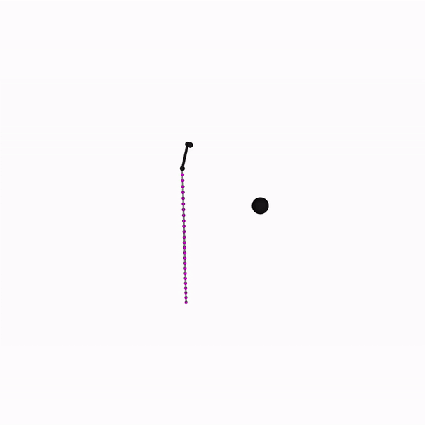

## **Hi there** 👋

Thank you for visiting my Github repo! My name is [**Moses**](https://mosesnah-shared.github.io/). 

I'm a current **Ph.D candidate at [MIT MECHE](https://github.com/mosesnah-shared)**, working at the [**MIT Newman Lab**](https://newmanlab.mit.edu/) under [**Prof. Neville Hogan**](https://scholar.google.com/citations?user=P7S5TY0AAAAJ&hl=en)

**Fascinated by Robotics at my early 20s via the two books** written by [**Norbert Wiener**](https://en.wikipedia.org/wiki/Norbert_Wiener) - [**Cybernetics**](https://en.wikipedia.org/wiki/Cybernetics:_Or_Control_and_Communication_in_the_Animal_and_the_Machine) and [**The Human Use of Human Beings**](https://en.wikipedia.org/wiki/The_Human_Use_of_Human_Beings), 
I promised myself to be a Roboticist. One of Wiener's piercing insight which broadened my perspective was the claim that **humans and robots are fundamentally the same as information-processing entities.**

I simply *love* **Math and Physics**. In case you if are interested, check out **some of my notes [here](https://mosesnah-shared.github.io/notes_index.html)**. 
I also do a lot of coding, and you can check all my codes here! Enjoy :grin:

<p align="center">
  
</p>

## **Research - Key Videos** 
<p align="center">
  
</p>

## **Languages and Tools** (Still Actively Learning :sunglasses:) 

<p align="left"> 
<a href="https://www.arduino.cc/" target="_blank" rel="noreferrer">  </a> 
<a href="https://www.gnu.org/software/bash/" target="_blank" rel="noreferrer">  </a> 
<a href="https://www.cprogramming.com/" target="_blank" rel="noreferrer">  </a> 
<a href="https://www.w3schools.com/cpp/" target="_blank" rel="noreferrer">  </a> 
<a href="https://www.docker.com/" target="_blank" rel="noreferrer">  </a> 
<a href="https://git-scm.com/" target="_blank" rel="noreferrer">  </a> 
<a href="https://jekyllrb.com/" target="_blank" rel="noreferrer">  </a> 
<a href="https://www.jenkins.io" target="_blank" rel="noreferrer">  </a> 
<a href="https://www.linux.org/" target="_blank" rel="noreferrer">  </a> 
<a href="https://www.mathworks.com/" target="_blank" rel="noreferrer">  </a> 
<a href="https://opencv.org/" target="_blank" rel="noreferrer">  </a> 
<a href="https://pandas.pydata.org/" target="_blank" rel="noreferrer">  </a>
<a href="https://www.photoshop.com/en" target="_blank" rel="noreferrer">  </a>
 <a href="https://www.python.org" target="_blank" rel="noreferrer">  </a>
 <a href="https://pytorch.org/" target="_blank" rel="noreferrer">  </a> 
 <a href="https://scikit-learn.org/" target="_blank" rel="noreferrer">  </a> 
 <a href="https://seaborn.pydata.org/" target="_blank" rel="noreferrer">  </a> 
 </p>

## **My Activity** (To be Productive :sweat_smile:)

<!--START_SECTION:waka-->

```txt
Python   1 hr 30 mins    ████████████████████▓░░░░   83.32 %
Bash     18 mins         ████░░░░░░░░░░░░░░░░░░░░░   16.60 %
Other    0 secs          ░░░░░░░░░░░░░░░░░░░░░░░░░   00.04 %
Text     0 secs          ░░░░░░░░░░░░░░░░░░░░░░░░░   00.04 %
```

<!--END_SECTION:waka-->

## **My Github Stats** (Just for Personal Use :innocent:):
[](https://github.com/anuraghazra/github-readme-stats)
